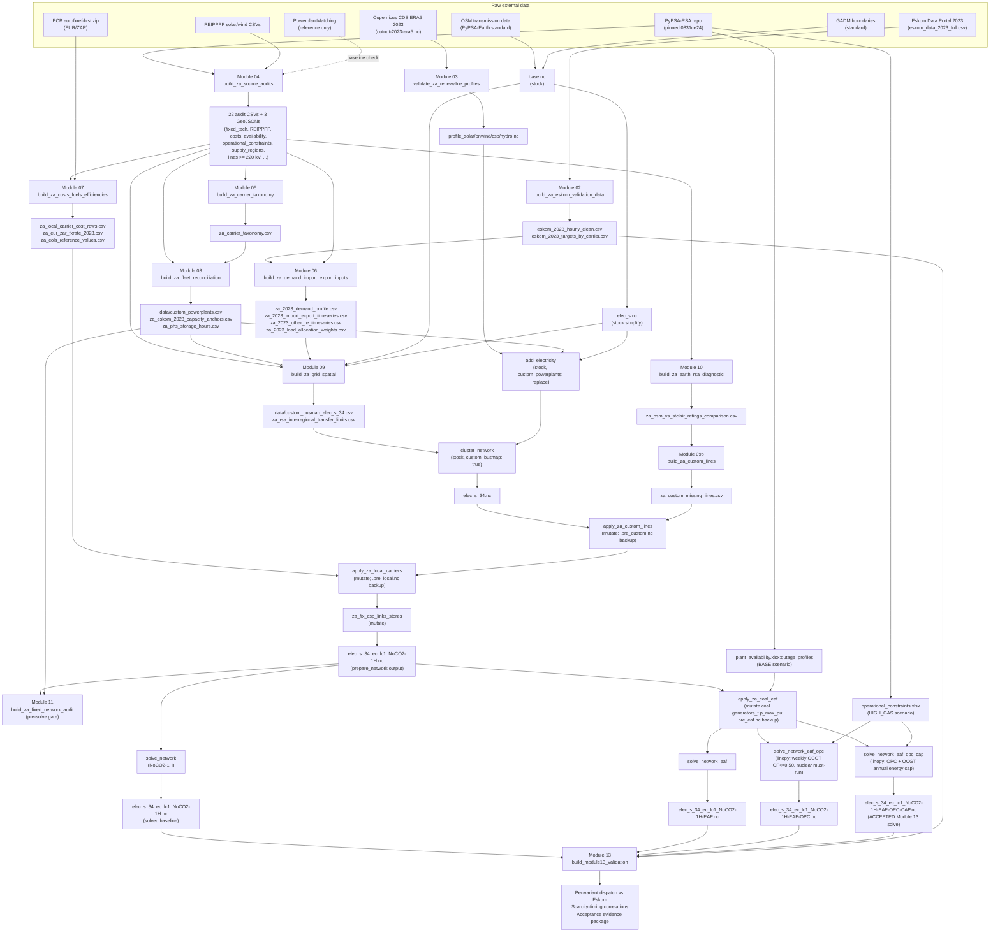

# ZA 2023 Fixed-Validation Model — Audit and Reconstruction Reference

This document is the **standalone audit reference** for the South Africa 2023
fixed-capacity validation model built on top of stock PyPSA-Earth. It exists so
that a reader with no prior context can:

1. **Reconstruct** the model from scratch (every config override, every custom
   Snakemake rule, every injected data file is enumerated).
2. **Audit** every deviation from stock PyPSA-Earth (config delta, rule
   inventory, and decision rationale make all overrides explicit and defended).
3. **Toggle** any injection layer on or off — the **stock-vs-calibrated
   comparison** (Option A) is operationalised through the toggle map in
   Section 5.

The document describes the **current state** of the model after Modules 00–13.
It is not a chronological build log; for that, see `doc/za_implementation_log.md`.

## The Four Solve Variants

| Tag | Scenario opt | Adds | Accepted role |
|---|---|---|---|
| **NoCO2-1H** | `NoCO2-1H` | Structural baseline; fixed 2023 fleet & grid; no outage modelling | Reference / floor |
| **NoCO2-1H-EAF** | + `apply_za_coal_eaf` | Coal station-weekly availability overlay (PyPSA-RSA HIGH_GAS) | Coal-realism intermediate |
| **NoCO2-1H-EAF-OPC** | + operational constraints (linopy) | Weekly OCGT CF cap (≤0.50) + nuclear must-run | OPC intermediate |
| **NoCO2-1H-EAF-OPC-CAP** | + OCGT annual cap (linopy) | Bounds OCGT (diesel+gas) annual energy to physical 2023 fuel supply | **Accepted Module 13 solve** |

The variant chain is **additive**: each later variant inherits all prior
mutations and adds one more constraint layer. The Snakefile encodes ordering
via rule precedence (see Section 2).

## How to use this document

- **Reconstructing the model:** read Section 1 (config) → Section 2 (rules) →
  Section 3 (data files) → Section 6 (DAG). Together these enumerate every
  build artefact and the order of operations.
- **Running a stock-vs-calibrated comparison:** read Section 5. Each row is one
  toggleable injection layer with a concrete failure mode and an effort tier.
- **Defending a calibration choice:** read Section 7. One line per non-trivial
  override naming the chosen source, the alternative, and the rejection reason.
- **Understanding a single solve variant:** read Section 4.

---

## Section 1 — Config Delta

### 1.1 Overlay precedence

The active configuration is the **union** of two YAML files, with the overlay
taking precedence on every key it sets:

| Layer | File | Role |
|---|---|---|
| Base | `config.default.yaml` | Stock PyPSA-Earth defaults (Africa-wide) |
| Overlay | `configs/za/za_2023_fixed_validation.yaml` | ZA 2023 fixed-validation overrides |

The top-level `config.yaml` at the repository root is **functionally empty**
(contains only `run: {}` and a comment). It is **not** the ZA configuration.

Invocation:

```
snakemake --configfile configs/za/za_2023_fixed_validation.yaml ...
```

Two additional overlays in `configs/za/` (`za_2023_smoke_stage1.yaml`,
`za_2023_smoke_stage2.yaml`) are pipeline smoke variants used during build
debugging; they are **not** the accepted solve configuration.

### 1.2 Delta table

Every key where the overlay differs from `config.default.yaml`. Values shown
verbatim. `module` is the calibration module that introduced or owns the
override. Default values truncated where long but exact for the diffed scope.

| Key path | Default value | ZA overlay value | Module | Reason |
|---|---|---|---|---|
| `countries` | `["NG", "BJ"]` | `["ZA"]` | 01 | Target country lock |
| `run.name` | `""` | `"za_2023_fixed_validation"` | 01 | Run namespace; drives `networks/{run}/` paths |
| `run.shared_cutouts` | `true` | `true` (explicit) | 03 | Reuse pre-built 2023 cutout |
| `scenario.clusters` | `[10]` | `[34]` | 09 | Lock to 34 Eskom local-area supply regions |
| `scenario.ll` | `["copt"]` | `["c1"]` | 12 | `c1` = cost-limit factor 1.0 (no transmission expansion); fixed 2023 grid |
| `scenario.opts` | `[Co2L-3h]` | `["NoCO2-1H"]` | 12 | Hourly resolution; no dispatch-level CO₂ cap; variant chain is applied post-`solve_network` via dedicated rules (see Section 2) |
| `snapshots.start` | `2013-01-01` | `2023-01-01` | 01, 06 | Validation target year |
| `snapshots.end` | `2014-01-01` | `2024-01-01` | 01, 06 | Validation target year |
| `enable.retrieve_cutout` | `true` | `false` | 03 | Pre-built 2023 ERA5 cutout reused; no download |
| `enable.build_cutout` | `false` | `false` (explicit) | 03 | — |
| `enable.custom_busmap` | `false` | `true` | 09 | Activates `data/custom_busmap_elec_s_34.csv` |
| `atlite.default` | `cutout-2013-era5` | `cutout-2023-era5` | 03 | Switch to 2023 weather year |
| `atlite.cutouts.cutout-2023-era5` | (not defined) | `{module: era5, dx: 0.3, dy: 0.3}` | 03 | New 2023 cutout definition |
| `load_options.weather_year` | `2013` | `2023_custom` | 06 | Routes demand build through Module 06 builder (Eskom-anchored) |
| `load_options.ssp` | `"ssp2-2.6"` | `"ssp2-2.6"` (explicit) | 06 | — |
| `load_options.prediction_year` | `2030` | `2030` (explicit) | 06 | — |
| `load_options.scale` | `1` | `1` (explicit) | 06 | — |
| `electricity.co2limit` | `7.75e+7` | `null` | 12 | Structural baseline has no binding dispatch CO₂ cap; CO₂ deferred to policy scenarios |
| `electricity.custom_powerplants` | `false` | `"replace"` | 08 | Bypass PPM entirely; use `data/custom_powerplants.csv` |
| `electricity.estimate_renewable_capacities.stats` | `"irena"` | `false` | 08 | Renewable capacities come from custom_powerplants, not IRENA |
| `electricity.conventional_carriers` | `[nuclear, oil, OCGT, CCGT, coal, lignite, geothermal, biomass]` | `[coal, nuclear]` | 05 | V1 boundary: only Eskom 2023 conventional carriers; OCGT split into local `ocgt_diesel`/`ocgt_gas` (added post-`add_electricity`) |
| `electricity.renewable_carriers` | `[solar, onwind, offwind-ac, offwind-dc, hydro]` | `[solar, onwind, hydro, csp]` | 05 | No offshore wind in ZA 2023; CSP added |
| `electricity.extendable_carriers.Generator` | `[solar, onwind, offwind-ac, offwind-dc, OCGT]` | `[]` | 11, 12 | Fixed-capacity baseline; no expansion |
| `electricity.extendable_carriers.StorageUnit` | `[]` | `[]` (explicit) | 11 | — |
| `electricity.extendable_carriers.Store` | `[battery, H2]` | `[]` | 11 | No store expansion |
| `electricity.extendable_carriers.Link` | `[]` | `[]` (explicit) | 11 | — |
| `electricity.powerplants_filter` | `(DateOut >= 2022 …) and (DateIn <= 2023 …)` | identical (explicit) | 08 | Keep rows operational in 2023 |
| `renewable.hydro.multiplier` | `1.1` | `1.20` | 12 | Composed structural correction: IRENA-vs-Eskom scope (~1.065) × efficiency double-count (1/0.9 ≈ 1.111) ≈ 1.183, rounded to 1.20; year-portable, NOT tuned to 2023 dispatch |
| `costs.year` | `2030` | `2030` (explicit) | 07 | No 2023 cost table available; 2030 used as proxy |
| `costs.output_currency` | `"EUR"` | `"ZAR"` | 07 | Local-currency cost frame; conversions use frozen 2023 EUR/ZAR = 20.3477 |
| `costs.electricity_grid_connection` | `(default applies)` | `0` | 08 | Disable upstream per-generator grid-connection capex; full capex is reconciled per plant via `custom_powerplants.csv` |
| `solving.solver.name` | `gurobi` | `gurobi` (explicit) | 12 | — |
| `solving.solver.options` | `gurobi-default` | `gurobi-default` (explicit) | 12 | — |
| `solving.solver_options.gurobi-default.threads` | `4` | `2` | 12 | Constrain solver footprint on local hardware |
| `solving.solver_options.gurobi-default.method` | `2` | `2` (explicit) | 12 | Barrier |
| `solving.solver_options.gurobi-default.crossover` | `0` | `0` (explicit) | 12 | Skip crossover |
| `solving.solver_options.gurobi-default.BarConvTol` | `1.e-6` | `1.e-5` | 12 | Looser barrier convergence; trade accuracy for solve time on hourly model |
| `solving.solver_options.gurobi-default.OptimalityTol` | (unset) | `1.e-6` | 12 | Explicit optimality bound |
| `solving.solver_options.gurobi-default.FeasibilityTol` | (unset) | `1.e-6` | 12 | Explicit feasibility bound |
| `solving.solver_options.gurobi-default.Seed` | `123` | (not set in ZA overlay — inherited or dropped depending on merge depth) | 12 | — |
| `solving.solver_options.gurobi-default.AggFill` | `0` | (not set in ZA overlay — inherited or dropped depending on merge depth) | 12 | — |
| `solving.solver_options.gurobi-default.PreDual` | `0` | (not set in ZA overlay — inherited or dropped depending on merge depth) | 12 | — |
| `solving.solver_options.gurobi-default.GURO_PAR_BARDENSETHRESH` | `200` | (not set in ZA overlay — inherited or dropped depending on merge depth) | 12 | — |
| `solving.options.load_shedding` | `100` (EUR/kWh = 100,000 EUR/MWh) | `true` (PyPSA default ≈ 100 EUR/MWh safety-valve) | 12 | Safety-valve frame; policy CoLE frame held separately in `za_cols_policy` |
| `solving.options.noisy_costs` | `true` | `false` | 12 | Disable cost perturbation for deterministic reruns |

### 1.3 New top-level keys (no default-config equivalent)

The overlay introduces eight ZA-specific top-level config sections. These are
consumed by the ZA scripts and do not exist in `config.default.yaml`.

| Top-level key | Owned by | Purpose |
|---|---|---|
| `za_cols_policy` | Module 07 | Policy CoLS reference values (CSIR R116,570/MWh, Nova R9,530/MWh, Deloitte R8,950/MWh) for dual-frame load-shedding reporting |
| `pypsa_rsa_root` | Module 04 | Absolute path to the local PyPSA-RSA reference repository |
| `pypsa_rsa_pinned_commit` | Module 04 | Git pin of PyPSA-RSA: `0831ce243f0badbba6f09b418c2b57774ea89a5f` |
| `za.operational_constraints` | Module 12 | Toggles the OPC variant, names the workbook (`pypsa-rsa/scenarios/Coal_Flexibilisation/sub_scenarios/operational_constraints.xlsx`) and scenario (`HIGH_GAS`) |
| `za_system_boundary` | Module 05 | Locks V1 scope: national SA 2023 electricity, RSA Contracted Demand, MLR+ILS+IOS load-shedding target, exogenous IE, embedded PV excluded, CSP 500 MW / 1.375 TWh anchors |
| `za_local_carriers` | Module 05 | Adds `ocgt_diesel`, `ocgt_gas` carriers (component metadata, colour, validation target) — injected by `apply_za_local_carriers`. **Note:** `ocgt_gas` is defined with a cost row but has zero capacity in the 2023 fleet — all Natural Gas rows were removed with Sasol (Module 12). The carrier is present in the network's Carrier table but has no attached generators. |
| `za_known_omissions` | Module 05 | Documents Eskom "Other RE" (238 GWh in 2023) as deferred aggregate |
| `za_grid_spatial` | Module 09 | Spatial level lock (34), supply-region layer (34), 220 kV line floor, St Clair coefficients `[53.736, -0.65]`, `s_max_pu: 0.7`, n-1 factor `0.7`, per-voltage SIL and thermal MW tables |

---

## Section 2 — Custom Snakemake Rule Inventory

Every rule beyond stock PyPSA-Earth, with hook point, mutations, backups, and
audit outputs. Rules that mutate a `.nc` network in place always write a
`pre_*.nc` backup before mutation so the operation is reversible.

### 2.1 Builder rules (write CSVs, GeoJSONs, or new artefacts)

| Rule | Script | Inputs | Outputs | Hook point | Module | What breaks if removed |
|---|---|---|---|---|---|---|
| `build_za_eskom_validation_data` | `scripts/build_za_eskom_validation_data.py` | `data/za_audit/raw/eskom_data_2023_full.csv` | `data/za_validation/eskom_2023_hourly_clean.csv`, `eskom_2023_targets_by_carrier.csv`, `eskom_2023_parser_report.csv` | Independent (validation upstream) | 02 | All Eskom-anchored validation in Modules 06, 08, 12, 13 has no ground truth |
| `validate_za_renewable_profiles` | `scripts/validate_za_renewable_profiles.py` | `resources/{run}/renewable_profiles/profile_{tech}.nc`, `cutouts/cutout-2023-era5.nc`, `eskom_2023_targets_by_carrier.csv` | `data/za_audit/za_atlite_renewable_profile_validation.csv`, `za_atlite_technical_potential.csv`, `doc/za_renewable_profile_validation.md` | After `build_renewable_profiles` | 03 | Renewable profile sanity check missing; ERA5/atlite biases go undetected |
| `build_za_source_audits` | `scripts/build_za_source_audits.py` (orchestrator, drives `scripts/za_audits/*`) | `pypsa_rsa_root`, PowerplantMatching config | 22 audit CSVs + 3 GeoJSONs (registry, fixed-tech, REIPPPP wind/solar, cost/fuel/emissions, availability, operational-constraints, load weights, supply regions, lines ≥220 kV, planned TDP, substations, etc.) | Independent (one-shot reference build) | 04 | Modules 05, 06, 07, 08, 09, 12 lose all their PyPSA-RSA-derived inputs |
| `build_za_carrier_taxonomy` | `scripts/build_za_carrier_taxonomy.py` | `za_local_carriers`, `za_system_boundary`, `pypsa_rsa_fixed_technologies_2023_candidates.csv` | `za_carrier_taxonomy.csv`, `za_carrier_taxonomy_crosscheck.csv` | Independent (lookup) | 05 | Local-carrier injection (Module 11) and cost-row generation (Module 07) lose the canonical carrier list |
| `build_za_demand_import_export_inputs` | `scripts/build_za_demand_import_export_inputs.py` | `eskom_2023_hourly_clean.csv`, `eskom_2023_targets_by_carrier.csv`, `pypsa_rsa_load_weight_audit.csv`, `data/ssp2-2.6/2030/era5_2023_custom/Africa.csv` | `za_2023_demand_profile.csv`, `za_2023_import_export_timeseries.csv`, `za_2023_other_re_timeseries.csv`, `za_2023_load_allocation_weights.csv`, IE/other-RE attachment CSVs | Replaces upstream GEGIS demand resolution | 06 | Model falls back to synthetic SSP2-2.6 2030 demand; loses Eskom 2023 alignment |
| `build_za_costs_fuels_efficiencies` | `scripts/build_za_costs_fuels_efficiencies.py` (drives `scripts/za_costs/*`) | `pypsa_rsa_cost_fuel_emissions_audit.csv`, ECB historical FX | `za_costs_fuels_efficiencies_audit.csv`, `za_local_carrier_cost_rows.csv`, `za_eur_zar_fxrate_2023.csv`, `za_cols_reference_values.csv`, `doc/za_costs_fuels_efficiencies_and_coUE.md` | Before `apply_za_local_carriers` | 07 | OCGT carriers cannot be priced; ZAR-denominated coal/nuclear marginal costs missing |
| `build_za_fleet_reconciliation` | `scripts/build_za_fleet_reconciliation.py` (drives `scripts/za_fleet/*`) | `pypsa_rsa_fixed_technologies_2023_candidates.csv`, `reipppp_wind_2023_candidates.csv`, `reipppp_solar_2023_candidates.csv`, `za_carrier_taxonomy.csv` | **`data/custom_powerplants.csv`** (core network input), `za_powerplant_reconciliation.csv`, `za_named_plant_inventory.csv`, `za_eskom_2023_capacity_anchors.csv`, `za_phs_storage_hours.csv`, `za_powerplants_normalization_diff.csv`, `doc/za_powerplant_reconciliation.md` | Replaces PPM for `add_electricity` (driven by `electricity.custom_powerplants: replace`) | 08 | PPM is used; PPM misses ~13 GW of 2023 RE and mis-attributes ~9 GW of coal (Module 10 audit) |
| `build_za_grid_spatial` | `scripts/build_za_grid_spatial.py` (drives `scripts/za_grid_spatial/*`) | `networks/{run}/base.nc`, `elec_s.nc`, `za_rsa_existing_lines_220kv_plus.geojson`, `custom_powerplants.csv`, load/IE/other-RE weight CSVs | **`data/custom_busmap_elec_s_34.csv`** (clustering input), `za_pypsa_earth_osm_grid_summary.csv`, `za_rsa_interregional_transfer_limits.csv`, `za_spatial_level_lock.csv`, bus attachment CSVs (plant/demand/IE/other-RE), `za_custom_busmap_coverage.csv`, `doc/za_grid_reconciliation.md` | Before `cluster_network` (consumes its busmap) | 09 | Automatic k-means clustering runs; 34 buses no longer align with Eskom supply areas; downstream attachments break |
| `build_za_custom_lines` | `scripts/build_za_custom_lines.py` | `za_osm_vs_stclair_ratings_comparison.csv` | `za_custom_missing_lines.csv` | Before `apply_za_custom_lines` | 09b | 10 unmatched St Clair corridors stay absent; `apply_za_custom_lines` has nothing to inject |
| `build_za_earth_rsa_diagnostic` | `scripts/build_za_earth_rsa_diagnostic.py` (drives `scripts/za_diagnostic/*`) | `za_powerplant_reconciliation.csv`, `za_rsa_existing_lines_220kv_plus.geojson`, `za_grid_reconciliation.csv`, `za_rsa_interregional_transfer_limits.csv` | `za_ppm_vs_rsa_fleet_comparison.csv`, `za_ppm_plants_not_in_rsa.csv`, `za_rsa_plants_not_in_ppm.csv`, `za_substations_comparison.csv`, `za_rsa_substations_derived.csv`, **`za_osm_vs_stclair_ratings_comparison.csv`** (feeds 09b), `doc/za_earth_rsa_baseline_diagnostic.md`, figures | Diagnostic (one-shot) | 10 | The St Clair vs OSM rating comparison disappears; `build_za_custom_lines` cannot derive missing corridors |
| `build_za_fixed_network_audit` | `scripts/build_za_fixed_network_audit.py` | `networks/{run}/elec_s_34_ec_l{ll}_{opts}.nc`, `za_eskom_2023_capacity_anchors.csv` | `za_fixed_network_audit.csv` | Pre-solve gate; runs after all `apply_*` mutations | 11 | Pre-solve sanity check (zero extendable capacity; ±5 % Eskom anchor match) is skipped; broken mutations can slip into solve |
| `build_module13_validation` | `scripts/za_validation/build_module13_validation.py` | Solved `.nc` for all four variants, `eskom_2023_hourly_clean.csv`, `eskom_2023_targets_by_carrier.csv` | Post-solve audit CSVs (per-variant dispatch vs Eskom, constraint verification, scarcity-timing correlations) | After `solve_network_eaf_opc_cap` | 13 | Acceptance evidence package missing; no formal pass/fail for the four variants |

### 2.2 Apply / mutation rules (rewrite `.nc` in place)

Each writes a `pre_*.nc` backup and a per-rule audit CSV so the mutation is
both reversible and auditable.

| Rule | Script | Components touched | Backup file | Audit CSV | Module | What breaks if removed |
|---|---|---|---|---|---|---|
| `apply_za_custom_lines` | `scripts/apply_za_custom_lines.py` | `Line` rows added (bus0, bus1, v_nom, length, num_parallel, s_nom, x, r, b, type) for 10 unmatched 275/400 kV corridors | `elec_s_34.pre_custom.nc` | `za_custom_lines_audit.csv` | 09b | ~12 GW of inter-regional transmission capacity absent; constrained corridors flag inter-regional infeasibility under stress |
| `apply_za_local_carriers` | `scripts/apply_za_local_carriers.py` (uses `scripts/za_costs/local_rows.py`) | `Carrier` rows added (`ocgt_diesel`, `ocgt_gas` with colour, nice_name, co2_emissions); `Generator.marginal_cost` patched on coal & nuclear from ZAR-denominated rows; OCGT generators attached from custom_powerplants rows tagged with these carriers | `elec_s_34.pre_local.nc` | `za_local_carriers_audit.csv` | 11/12 | Solve crashes at `add_carrier`: OCGT generators reference carriers with no `Carrier` row. Even if the crash is patched, coal/nuclear marginal costs revert to upstream EUR defaults — dispatch order may invert |
| `za_fix_csp_links_stores` | `scripts/za_fleet/fix_csp_links_stores.py` (invoked via module hook in Module 12) | `Link` (thermal-out) rewired to feed `Store` input; broken `ElectrochemicalPHES` topology removed; CSP `StorageUnit` rows replaced with `Store` + `Link` pattern | (in-memory mutation during solve preprocessing) | `za_csp_links_stores_audit.csv` | 12 | CSP dispatch is structurally invalid — TES energy balance does not close; CSP generation drifts to zero or infinity depending on solver path |
| `apply_za_coal_eaf` | `scripts/za_fleet/apply_coal_eaf.py` | `generators_t.p_max_pu` for coal carrier reduced by station-weekly outage profile from PyPSA-RSA `plant_availability.xlsx:outage_profiles` (**BASE scenario** — not HIGH_GAS; HIGH_GAS is used only by the OPC/CAP workbook `operational_constraints.xlsx`) | `elec_s_34_ec_lc1_NoCO2-1H.pre_eaf.nc` | `za_coal_eaf_audit.csv` | 12 | EAF variant (and all downstream EAF+OPC, EAF+OPC+CAP) cannot be produced; baseline NoCO2-1H solve still runs but coal is at flat 100 % availability year-round |

### 2.3 Solve and materialisation rules

| Rule | Purpose | Inputs | Outputs | Module |
|---|---|---|---|---|
| `solve_network` | Baseline solve (NoCO2-1H) | `elec_s_34_ec_lc1_NoCO2-1H.nc` (post all builders + apply_za_custom_lines + apply_za_local_carriers + za_fix_csp_links_stores) | `elec_s_34_ec_lc1_NoCO2-1H.nc` (solved) | 12 |
| `solve_network_eaf` | EAF variant solve | Output of `apply_za_coal_eaf` | `elec_s_34_ec_lc1_NoCO2-1H-EAF.nc` | 12 |
| `solve_network_eaf_opc` | EAF+OPC variant solve; applies operational-constraints workbook (`HIGH_GAS` scenario) as linopy constraints at solve time | Output of `apply_za_coal_eaf` + `operational_constraints.xlsx` | `elec_s_34_ec_lc1_NoCO2-1H-EAF-OPC.nc`, `za_operational_constraints_audit_34_NoCO2-1H.csv` | 12 |
| `solve_network_eaf_opc_cap` | EAF+OPC+CAP — adds an annual energy cap on combined OCGT (`ocgt_diesel`+`ocgt_gas`) as a linopy constraint read from the OPC workbook | Output of `apply_za_coal_eaf` + `operational_constraints.xlsx` + cap row (HIGH_GAS / global / ocgt_diesel / output_energy / year / max / 5.5 TWh, added 2026-05-13 to pypsa-rsa) | `elec_s_34_ec_lc1_NoCO2-1H-EAF-OPC-CAP.nc`, `za_operational_constraints_audit_34_NoCO2-1H_EAF_OPC_CAP.csv` | 12 |
| `materialize_za_op_constraints_audit` | Copies OPC solve diagnostic CSV to `data/za_audit/za_operational_constraints_audit.csv` for persistence | OPC solve output CSV | `data/za_audit/za_operational_constraints_audit.csv` | 12 |
| `materialize_za_op_constraints_audit_cap` | Same for the CAP variant | CAP solve output CSV | `data/za_audit/za_operational_constraints_audit_cap.csv` | 12 |

### 2.4 Rule ordering

The Snakefile encodes the variant chain via `ruleorder` (around L1448 ff.):

```
apply_za_coal_eaf > prepare_network
solve_network_eaf_opc_cap > solve_network_eaf_opc > solve_network_eaf > solve_network
```

This ensures higher-tier solves (CAP > OPC > EAF > baseline) are preferred
when the wildcard chain could match multiple rules.

---

## Section 3 — Data File Registry

Every non-stock input file. SHA256 hashes are recorded for tracked artefacts in
`data/za_audit/input_file_manifest.csv` and `pypsa_rsa_source_registry.csv`;
they are not duplicated here.

### 3.1 Core network inputs (read by stock PyPSA-Earth rules)

| Path | Content | Source | Produced by | Consumed by | Module |
|---|---|---|---|---|---|
| `data/custom_powerplants.csv` | Reconciled 2023 fleet (135 data rows post-Sasol-removal): 27 Eskom coal units, Koeberg nuclear, 4 PHS stations (Drakensberg, Ingula, Palmiet, Steenbras), 6 CSP plants, REIPPPP wind/solar, OCGT diesel/gas, Hex battery. **Known silent-drop:** 3 Bioenergy rows (Joburg Landfill 7.56 MW, Ngodwana 25 MW, Sappi 144 MW = 176.56 MW) are present in the CSV but the `biomass` carrier is excluded from both `conventional_carriers` and `renewable_carriers` in the config, so `add_electricity` silently drops them. Deferred to Module 14. | Module 08 reconciliation of PyPSA-RSA fixed-tech + REIPPPP CSVs + Eskom anchors | `build_za_fleet_reconciliation` | `add_electricity` (stock rule, switched via `electricity.custom_powerplants: replace`) | 08 |
| `data/custom_busmap_elec_s_34.csv` | Simplified-OSM bus → 1-of-34 Eskom supply region mapping; 803 buses → 34 regions, 0 orphans | Module 09 spatial join of OSM buses against `za_rsa_supply_regions.geojson` | `build_za_grid_spatial` | `cluster_network` (stock rule, switched via `enable.custom_busmap: true`) | 09 |

### 3.2 Eskom validation timeseries (`data/za_validation/`)

| Path | Content | Source | Module |
|---|---|---|---|
| `eskom_2023_hourly_clean.csv` | 8,760-row hourly: RSA Contracted Demand, thermal/nuclear/OCGT/hydro/RE/Other-RE generation, international imports/exports, load-shedding, capacity factors | Eskom Data Portal 2023 export, parsed by `build_za_eskom_validation_data` | 02 |
| `eskom_2023_targets_by_carrier.csv` | Per-carrier annual TWh + per-tech installed-capacity anchors with pass/fail tolerances | Aggregated from hourly clean + capacity EOY2023 | 02 |
| `eskom_2023_parser_report.csv` | Parser diagnostics (10,263 comma-decimal repairs, residual-demand identity check) | Module 02 | 02 |
| `za_2023_demand_profile.csv` | Regional hourly demand, 8,760 × 34 | Module 06 disaggregation of national demand via `za_2023_load_allocation_weights.csv` | 06 |
| `za_2023_import_export_timeseries.csv` | Hourly import/export (Mozambique, Namibia, Eswatini, Zimbabwe interconnectors) | Eskom columns `International Imports` + `International Exports` | 06 |
| `za_2023_other_re_timeseries.csv` | Hourly "Other RE" exogenous generator profile (annual ≈ 238 GWh) | Eskom column `Other RE` | 06 | **Note:** `other_re` was intentionally removed from `apply_za_local_carriers.py` in Module 12 (2026-05-12) — incompatible with LP expansion and represents an undifferentiated aggregate (small hydro/landfill gas/biogas). The timeseries CSV is produced but the generator is not attached in the V1 network. Module 06 spec has not been updated to reflect this. Deferred to Module 14. |

### 3.3 Audit CSVs (`data/za_audit/`)

**Provenance / registry**

| Path | Content | Module |
|---|---|---|
| `input_file_manifest.csv` | Master inventory: artefact_id, path, present/missing, sha256, recorded_at | All |
| `pypsa_rsa_source_registry.csv` | Pinned PyPSA-RSA file inventory with hashes + ownership module | 04 |
| `source_hashes.csv` | Aggregate artefact provenance hashes | All |

**Module 04 — PyPSA-RSA-derived audits**

`pypsa_rsa_fixed_technologies_2023_candidates.csv`, `reipppp_wind_2023_candidates.csv`, `reipppp_solar_2023_candidates.csv`, `pypsa_rsa_cost_fuel_emissions_audit.csv`, `pypsa_rsa_availability_audit.csv`, `pypsa_rsa_operational_constraints_audit.csv`, `pypsa_rsa_load_weight_audit.csv`, `pypsa_rsa_discovery_sweep.csv`, `powerplants_pm_za_audit.csv` (PowerplantMatching baseline)

**Module 05 — taxonomy**

`za_carrier_taxonomy.csv`, `za_carrier_taxonomy_crosscheck.csv`

**Module 07 — costs**

`za_costs_fuels_efficiencies_audit.csv`, `za_local_carrier_cost_rows.csv` (OCGT diesel + gas marginal cost rows consumed by `apply_za_local_carriers`), `za_eur_zar_fxrate_2023.csv` (ECB eurofxref-hist.zip, frozen date 2023-12-29, rate **20.3477 ZAR/EUR**), `za_cols_reference_values.csv` (CSIR R116,570/MWh = R = 5.7k EUR/MWh; Nova R9,530/MWh; Deloitte R8,950/MWh)

**Module 08 — fleet**

`za_powerplant_reconciliation.csv`, `za_named_plant_inventory.csv`, `za_eskom_2023_capacity_anchors.csv`, `za_phs_storage_hours.csv` (Drakensberg 24 h, Ingula 20.69 h per `custom_powerplants.csv`: 27,400 MWh / 1,324 MW), `za_powerplants_normalization_diff.csv` (PowerplantMatching pre/post-normalisation delta)

**Module 09 — grid**

`za_pypsa_earth_osm_grid_summary.csv` (OSM line counts by voltage), `za_rsa_interregional_transfer_limits.csv` (St Clair N-1 corridor capacities), `za_grid_reconciliation.csv` (OSM vs RSA per-voltage per-region), `za_spatial_level_lock.csv`, `za_plant_bus_assignment.csv`, `za_demand_bus_attachment.csv`, `za_import_export_bus_attachment.csv`, `za_other_re_bus_attachment.csv`, `za_custom_busmap_coverage.csv`, `za_2023_load_allocation_weights.csv`, `za_2023_import_export_attachment.csv`, `za_2023_other_re_attachment.csv`, `za_rsa_supply_area_connection_limits.csv`, `za_rsa_mts_hosting_limits.csv`, `za_rsa_supply_region_layer_resolution.csv`

**Module 09b — custom lines**

`za_custom_missing_lines.csv`, `za_custom_lines_audit.csv`

**Module 10 — diagnostics**

`za_osm_vs_stclair_ratings_comparison.csv`, `za_ppm_vs_rsa_fleet_comparison.csv`, `za_ppm_plants_not_in_rsa.csv`, `za_rsa_plants_not_in_ppm.csv`, `za_substations_comparison.csv`, `za_rsa_substations_derived.csv`

**Module 11 — pre-solve gate**

`za_fixed_network_audit.csv`, `za_local_carriers_audit.csv`

**Module 12 — solve mutations**

`za_coal_eaf_audit.csv`, `za_operational_constraints_audit.csv`, `za_operational_constraints_audit_cap.csv`, `za_csp_links_stores_audit.csv`

### 3.4 GeoJSON files (`data/za_audit/`)

| Path | Content | Source | Module |
|---|---|---|---|
| `za_rsa_supply_regions.geojson` | 34 Eskom local-area supply regions (polygons; defines clustering target geography) | PyPSA-RSA `data/bundle/supply_regions/rsa_supply_regions.gpkg`, layer 34 | 04, 09 |
| `za_rsa_existing_lines_220kv_plus.geojson` | RSA existing transmission ≥220 kV (324 features, filtered from 348 by DESIGN_VOL) | PyPSA-RSA transmission GIS | 04, 09, 10 |
| `za_rsa_planned_tdp_lines.geojson` | RSA Transmission Development Plan 2023 planned lines (102 features) | PyPSA-RSA `data/bundle/transmission_grid/tdp_digitised/TDP_2023_32.shp` | 04 (reference only; not consumed by the fixed-fleet solve) |

### 3.5 Weather data and renewable profiles

| Path | Content | Source | Module |
|---|---|---|---|
| `cutouts/cutout-2023-era5.nc` | ERA5 2023 cutout over ZA, 0.3°×0.3° spatial, 8,760 hourly | Copernicus CDS ERA5 | 03 |
| `resources/{run}/renewable_profiles/profile_solar.nc` | PV `p_max_pu` per bus, 8,760 h | Atlite, `panel: CSi`, `orientation: latitude_optimal`, `capacity_per_sqkm: 4.6` | 03 |
| `resources/{run}/renewable_profiles/profile_onwind.nc` | Onshore wind `p_max_pu` per bus | Atlite, `turbine: Vestas_V112_3MW`, `capacity_per_sqkm: 3` | 03 |
| `resources/{run}/renewable_profiles/profile_csp.nc` | CSP `p_max_pu` per bus | Atlite `installation: SAM_solar_tower`, `csp_model: advanced`, `capacity_per_sqkm: 2.392` | 03 |
| `resources/{run}/renewable_profiles/profile_hydro.nc` | Hydro inflow per bus (post-Module-08 it is populated for ZA RoR/reservoir) | Atlite hydro method, `hydrobasins_level: 6`, with `renewable.hydro.multiplier: 1.20` (Module 12) | 03 |

### 3.6 Constraint sources (Module 12, read at solve time)

| Path (in PyPSA-RSA, pinned commit `0831ce24…`) | Sheet | Used by |
|---|---|---|
| `scenarios/Coal_Flexibilisation/sub_scenarios/operational_constraints.xlsx` | `operational_constraints` | `solve_network_eaf_opc`, `solve_network_eaf_opc_cap` (linopy constraints, `HIGH_GAS` scenario) |
| `plant_availability.xlsx` | `outage_profiles` | `apply_za_coal_eaf` (**BASE scenario** — filtered to `scenario == 'BASE'`; the HIGH_GAS scenario is used only by `operational_constraints.xlsx`) |

The OCGT annual cap value used by `solve_network_eaf_opc_cap` is **not** inlined
in the solve script. It is a row in `operational_constraints.xlsx` (HIGH_GAS
scenario, scope `global`, carrier `ocgt_diesel`, constraint type
`output_energy / year / max`, value `5,500,000 MWh = 5.5 TWh`). This row was
added to the pypsa-rsa workbook on 2026-05-13 and is present at pinned commit
`0831ce24…`. To change the cap, edit that workbook row and re-run
`solve_network_eaf_opc_cap`.

### 3.7 ZA-specific scripts package (`scripts/`)

| Package | Files (representative) | Purpose |
|---|---|---|
| `scripts/za_costs/` | `audit_builder.py`, `currency.py`, `fxrate.py`, `local_rows.py` | Cost / fuel / FX builders; OCGT cost rows; ECB EUR/ZAR fetcher |
| `scripts/za_fleet/` | `reconciliation.py`, `custom_powerplants.py`, `named_inventory.py`, `eskom_anchors.py`, `apply_coal_eaf.py`, `operational_constraints.py`, `fix_csp_links_stores.py`, `normalization_smoke.py` | Fleet reconciliation; EAF/OPC/OCGT-cap appliers; CSP topology fixer |
| `scripts/za_grid_spatial/` | `bus_attachments.py`, `busmap.py`, `osm_summary.py`, `reconciliation.py`, `rsa_corridors.py`, `supply_regions.py`, `lock.py`, `io.py` | 34-region busmap; St Clair corridor builder; OSM vs RSA reconciliation |
| `scripts/za_audits/` | `cost_fuel_emissions.py`, `fleet_availability.py`, `grid_spatial.py`, `load_weights.py`, `powerplantmatching.py`, `profiles.py`, `registry.py`, `resource_siting.py`, `scenario_workbooks.py`, `io.py` | Module 04 source-audit submodules |
| `scripts/za_diagnostic/` | `fleet_comparison.py`, `grid_voltage.py`, `ratings_comparison.py`, `report.py`, `substations.py` | Module 10 PyPSA-Earth vs PyPSA-RSA comparison logic |
| `scripts/za_validation/` | `build_module13_validation.py`, `smoke_carrier_taxonomy.py` | Module 13 post-solve validation orchestrator |

### 3.8 Upstream repository pins

| Repo | Pinned commit | Role |
|---|---|---|
| PyPSA-RSA | `0831ce243f0badbba6f09b418c2b57774ea89a5f` | Source for fixed-tech roster, costs, availability, operational constraints, grid GIS |
| `technology-data` | `v0.13.2` (via `costs.technology_data_version`) | Upstream cost CSVs (`costs_2030.csv`) |
| PyPSA-Earth | Working tree on `main` (run-time HEAD recorded in run logs) | Host repo |

---

## Section 4 — Solve Variant Delta Table

Each step shows only what changes versus the previous step.

| Step | Config keys changed | Inputs added or activated | Snakemake rules added | Practical dispatch effect |
|---|---|---|---|---|
| **NoCO2-1H** (baseline; built on top of stock PyPSA-Earth + Modules 01–11 + `apply_za_custom_lines` + `apply_za_local_carriers` + `za_fix_csp_links_stores`) | `scenario.opts: ["NoCO2-1H"]`; `electricity.co2limit: null` (vs default 7.75e7) | None beyond Module 11 pre-solve state | `solve_network` (stock, but consumes the Module-11-prepared network) | Coal at flat 100 % availability all year; no operational constraints; OCGT carriers exist but no cap; CSP topology fixed |
| **+EAF** (NoCO2-1H-EAF) | (no config change; rule chain selects variant) | `pypsa-rsa/.../plant_availability.xlsx:outage_profiles` (**BASE scenario** — `scenario == 'BASE'`; distinct from the HIGH_GAS scenario used by `operational_constraints.xlsx`) | `apply_za_coal_eaf`, `solve_network_eaf` | Coal `generators_t.p_max_pu` reduced station-by-station, week-by-week, by planned+unplanned outage. Coal annual energy drops; OCGT and load-shedding rise to fill the gap |
| **+EAF+OPC** (NoCO2-1H-EAF-OPC) | `za.operational_constraints.enable: true`; `scenario: "HIGH_GAS"` | `pypsa-rsa/.../operational_constraints.xlsx:operational_constraints` (HIGH_GAS) | `solve_network_eaf_opc`, `materialize_za_op_constraints_audit` | Active constraints in HIGH_GAS 2023: weekly OCGT (diesel+AVF) CF ≤ 0.50, nuclear must-run at `p = p_max_pu`. Other workbook rows (`ccgt_steam`, `rmippp`, `sasol_*`) silently no-op (carriers absent from 2023 fixed fleet). OCGT bounded weekly; load-shedding sharpens at peak weeks |
| **+EAF+OPC+CAP** (NoCO2-1H-EAF-OPC-CAP; **accepted Module 13 solve**) | (no config change; cap value is a workbook row in `operational_constraints.xlsx`, added 2026-05-13) | (none beyond OPC) | `solve_network_eaf_opc_cap`, `materialize_za_op_constraints_audit_cap` | Annual energy of combined OCGT (`ocgt_diesel`+`ocgt_gas`) bounded by an inline linopy constraint at ZA 2023 physical fuel-supply level. OCGT is fully utilised against the cap; residual scarcity absorbed by load-shedding (driving the defensible scarcity-timing correlation r ≈ 0.73 weekly, ≈ 0.85 monthly with Eskom realised LS) |

---

## Section 5 — Toggle Map (Option A enabler)

For each injection layer: how to disable it, what concretely breaks, and the
estimated effort. Effort tiers: **trivial** (one-line/no-op), **config change**
(edit overlay YAML and rerun), **rule bypass** (skip rule in Snakefile or use
the `pre_*.nc` backup network), **full re-run** (rebuild from raw inputs).

| # | Component | Control point | Stock default | ZA override | Module | What breaks if toggled off | Effort |
|---|---|---|---|---|---|---|---|
| 1 | Custom powerplants replacement | `electricity.custom_powerplants` | `false` (PPM only) | `replace` (PPM bypassed) | 08 | PPM is used: misses ~13 GW of 2023 RE (REIPPPP solar/wind not in PPM) and mis-attributes ~9 GW of coal (Module 10 audit); annual energy by carrier is incorrect | config change |
| 2 | 34-region custom busmap | `enable.custom_busmap` + presence of `data/custom_busmap_elec_s_34.csv` | `false` | `true` | 09 | k-means clustering produces 34 arbitrary buses not aligned with Eskom supply areas; plant/demand/IE bus attachments (which key on supply-area identity) become inconsistent | rule bypass |
| 3 | Custom transmission lines | `apply_za_custom_lines` rule | (no injection) | 10 corridors injected | 09b | ~12 GW of inter-regional transfer capacity absent; constrained corridors flag infeasibility at peak; load-shedding rises in regions cut off from coal supply | rule bypass (restore `elec_s_34.pre_custom.nc`) |
| 4 | OCGT local carriers | `apply_za_local_carriers` rule + `za_local_carriers` config block | (carriers absent) | `ocgt_diesel`, `ocgt_gas` carriers added | 11/12 | Solve crashes at `add_carrier`: OCGT generators reference non-existent carriers | config change (drop OCGT from `custom_powerplants.csv`) or rule bypass with patched custom_powerplants |
| 5 | ZAR-denominated coal & nuclear marginal costs | `costs.output_currency` + `za_local_carrier_cost_rows.csv` rows for coal/nuclear | stock EUR defaults | ZAR rows patched into network | 07 | Coal/nuclear marginal costs revert to upstream EUR defaults (×0.05 ZAR/EUR equivalent); coal becomes cheaper than nuclear and dispatch order may invert | config change |
| 6 | Coal EAF overlay | `apply_za_coal_eaf` rule | (no overlay) | BASE scenario station-weekly outage applied (from `plant_availability.xlsx`; HIGH_GAS is a separate workbook used only for OPC) | 12 | Coal at flat 100 % `p_max_pu` year-round; coal over-dispatch grows from ~+11 % to ~+25 % vs Eskom 2023; LS drops; only the baseline NoCO2-1H variant is producible | rule bypass (restore `pre_eaf.nc`); only affects EAF and downstream variants |
| 7 | Operational constraints (OPC) | `za.operational_constraints.enable` + `solve_network_eaf_opc` rule | (no constraints) | weekly OCGT CF ≤ 0.50, nuclear must-run | 12 | OCGT runs unconstrained on a weekly basis; nuclear free to ramp; OPC variant collapses into EAF | config change (`enable: false`) |
| 8 | OCGT annual cap | `solve_network_eaf_opc_cap` rule (cap value inline) | (no cap) | Annual OCGT energy ≤ 2023 physical fuel supply | 12 | OCGT runs against weekly OPC limit but no annual ceiling; OCGT annual energy exceeds physical fuel supply; LS underestimated; CAP variant collapses into OPC | rule bypass |
| 9 | CSP topology fix | `za_fix_csp_links_stores` invocation in Module 12 | (broken `ElectrochemicalPHES`) | `Store`+`Link` pattern wired to thermal-out | 12 | CSP TES energy balance fails to close; CSP dispatch invalid in solve (drifts to zero or solver-dependent garbage) | rule bypass not safe; would require full network rebuild |
| 10 | Eskom-anchored 2023 demand | `load_options.weather_year: 2023_custom` + `build_za_demand_import_export_inputs` outputs | stock `ssp2-2.6/2030/era5_2013` | 8,760 h × 34 regions, Eskom Contracted Demand | 06 | Synthetic SSP demand is used; profile diverges from Eskom by ~5–10 % at hour level; annual energy off by several TWh | config change |
| 11 | 2023 ERA5 cutout | `atlite.default` + `atlite.cutouts.cutout-2023-era5` | `cutout-2013-era5` | `cutout-2023-era5` (0.3°, 8,760 h) | 03 | 2013 cutout reused; renewable profiles wrong year; validation against Eskom 2023 nonsensical | config change (cutout rebuild if absent) |
| 12 | `costs.year: 2030` | `costs.year` | `2030` | `2030` (no 2023 costs available) | 07 | No effect at present (no `costs_2023.csv` exists); future drop-in is trivial | trivial |
| 13 | Frozen EUR/ZAR FX | `za_eur_zar_fxrate_2023.csv` + `costs.output_currency: ZAR` | live conversion or EUR output | 20.3477 ZAR/EUR (ECB 2023-12-29) | 07 | Cost conversions drift with live ECB rate; reruns become non-deterministic | config change |
| 14 | CoLE policy reference values | `za_cols_policy` block + `za_cols_reference_values.csv` | (solver safety valve only) | CSIR / Nova / Deloitte rows | 07 | Module 12 dual-frame reporting (safety valve vs policy CoLE) loses policy frame; safety valve at ≈100 EUR/MWh still works for solver | trivial (reporting only) |
| 15 | PyPSA-RSA pin | `pypsa_rsa_root` + `pypsa_rsa_pinned_commit` | (no pin) | `0831ce24…` | 04 | Modules 04, 07, 08, 09, 12 source audits all fail or drift with upstream RSA changes; build is no longer reproducible | full re-run |
| 16 | Custom carrier taxonomy | `za_local_carriers`, `za_system_boundary`, `electricity.conventional_carriers`, `renewable_carriers` | stock superset | 13 ZA carriers (coal, nuclear, ocgt_diesel, ocgt_gas, solar, onwind, hydro, csp, ror, PHS, battery, biomass-residual, other_re-deferred) | 05 | OCGT diesel/gas collapse into single `OCGT`; CSP collapsed into `solar`; cost rows lose specificity; per-carrier validation against Eskom breaks | rule bypass |
| 17 | Exogenous imports/exports | `za_2023_import_export_timeseries.csv` + attachment CSV | (none in PyPSA-Earth ZA-only run) | Mozambique/Namibia/Eswatini/Zimbabwe attached as fixed time-series | 06 | Net ~5 TWh/y of import disappears; supply gap widens by that amount; LS rises ~5 TWh/y | rule bypass |
| 18 | Exogenous "Other RE" generator | `za_2023_other_re_timeseries.csv` + attachment CSV | (none) | 50.58 MW curtailable, ~238 GWh/y | 06 | ~0.24 TWh/y exogenous RE absent; coal/OCGT rise marginally; documented as known omission | rule bypass |
| 19 | PHS storage hours (Drakensberg 24 h, Ingula 21 h) | `za_phs_storage_hours.csv` consumed in `build_za_fleet_reconciliation` | PyPSA-Earth default `PHS_max_hours: 6` | Explicit per-station storage hours | 08 | PHS sized at 6 h vs real ~21–24 h; intra-day arbitrage capacity halved; PHS generation drops further from already-low Module-13 levels | config change |
| 20 | Custom line thermal limits (St Clair N-1) | `za_grid_spatial.st_clair_coefficients`, `s_max_pu`, `n1_approx_single_lines`, `sil_mw`, `thermal_mw` | OSM-derived `s_nom` (no St Clair) | 55/65 corridors capped by St Clair N-1 | 09 | OSM `s_nom` (median ~10× over-rated per Module 10 audit) dominates; corridors transfer unphysical amounts of power; coal under-dispatch artefact appears | config change |
| 21 | 220 kV minimum line filter | `za_grid_spatial.line_voltage_threshold_kv: 220` | (no filter — all OSM voltages) | ≥220 kV only | 04, 09 | Sub-transmission lines pollute the corridor set; busmap quality degrades; St Clair fits become unstable | config change |
| 22 | Hydro inflow multiplier 1.20 | `renewable.hydro.multiplier` | `1.1` | `1.20` | 12 | Hydro generation drops ~9 % at annual level; below IRENA scope target; effect on system small (hydro ≈ 0.7 % of ZA generation) | config change |
| 23 | Gurobi solver | `solving.solver.name` + threads/method/tolerances | `gurobi` (defaults) | `gurobi`, threads 2, BarConvTol 1.e-5 | 12 | HiGHS or CBC used; solve time grows ~3–10×; convergence less reliable on hourly model | config change |
| 24 | Disable per-generator grid-connection capex | `costs.electricity_grid_connection: 0` | (default applies the upstream PR-f8eab87a hook) | `0` | 08 | Upstream grid-connection capex stacks on top of `custom_powerplants` capex → double-count for local carriers; effective marginal cost shifts | config change |
| 25 | Drop CO₂ dispatch cap (NoCO2 opt) | `electricity.co2limit: null` + `scenario.opts` includes `NoCO2-*` | `7.75e+7` (European) | `null` | 12 | Default European 77.5 Mt/y CO₂ cap binds against ZA fleet; coal output collapses (cap is sized for Europe, not the ZA coal fleet); solve becomes infeasible or dramatically under-dispatches coal | config change |

---

## Section 6 — Dependency DAG

> **Note (2026-05-15):** The companion graph files (`model_data_sources.graph.svg`,
> `.png`, `.pdf`) were generated from an earlier version of this document and
> may not reflect corrections applied during Module 13c (notably: EAF BASE vs
> HIGH_GAS label, OCGT cap workbook source). A graph rebuild is needed before
> Module 14 handoff. The mermaid source below is the authoritative version.

The DAG below shows the flow from raw external data through the calibration
modules to the four solved network variants. Apply / mutation rules are shown
as transformers on the network spine.



The mutations on the network spine (`apply_za_custom_lines`,
`apply_za_local_carriers`, `za_fix_csp_links_stores`, `apply_za_coal_eaf`) each
write a `pre_*.nc` backup of the input network. Restoring any backup is the
fast path for testing the toggle map in Section 5.

---

## Section 7 — Decision Rationale Log

One line per non-trivial override. Format: chosen source — why chosen;
alternative — why rejected.

- **`custom_powerplants: replace` over PPM** — PPM (Module 10 audit) misses ~13 GW of REIPPPP solar/wind and mis-attributes ~9 GW of coal in 2023; merging is unsafe because PPM dates and capacities collide with the corrected ZA roster.
- **34-region clustering over PyPSA-Earth k-means** — preserves Eskom local-area supply-region geography so RSA load weights, plant attachments, and St Clair corridors can be joined on a common topology; k-means produces arbitrary buses that destroy this join.
- **PyPSA-RSA pinned at `0831ce24…`** — provides curated 2023 fleet roster, availability, operational constraints, and grid GIS not present in PyPSA-Earth defaults; reproducibility requires a hard pin (upstream RSA refactors freely).
- **`cutout-2023-era5` (0.3°) over default `cutout-2013-era5`** — validation target is 2023; 2013 weather year is meaningless for Eskom 2023 comparison.
- **`weather_year: 2023_custom` over `2013`** — routes demand build through Module 06 (Eskom-anchored); alternative `weather_year: 2013` recovers SSP synthetic demand which diverges from realised 2023 by ~5–10 % hourly.
- **`costs.year: 2030`** — no `costs_2023.csv` exists in `technology-data v0.13.2`; documented as a proxy assumption (Module 07).
- **`costs.output_currency: ZAR` with frozen EUR/ZAR 20.3477** — local-currency frame matches PyPSA-RSA and Eskom reporting; live ECB rate rejected because it would make reruns non-deterministic.
- **Dual CoLE frame (CSIR R116,570/MWh policy + ≈100 EUR/MWh solver safety valve)** — policy frame and solver penalty differ by ≈57×; Module 12 requires both for defensible reporting; collapsing to one frame either makes the solve infeasible (policy) or under-prices scarcity (safety valve only).
- **Gurobi 12.0.3 with threads=2, BarConvTol=1.e-5** — empirically converges on the hourly 34-bus model; HiGHS rejected because solve time grows to multi-hour and convergence is fragile on hourly resolution.
- **`NoCO2-1H` opt (no dispatch-level CO₂ cap)** — ZA is outside the EU ETS; the default 77.5 Mt/y European cap, sized for European fleets, would either collapse ZA coal dispatch or make the model infeasible; policy CO₂ scenarios are deferred to expansion runs.
- **EAF from PyPSA-RSA `plant_availability.xlsx` BASE scenario** — `apply_za_coal_eaf` filters `outage_profiles` to `scenario == 'BASE'`; verified in `za_coal_eaf_audit.csv`. The OPC workbook (`operational_constraints.xlsx`) uses HIGH_GAS — these are two different workbooks with different scenario semantics.
- **Operational constraints applied as linopy constraints, not network attributes** — composability with the CAP variant requires both layers to be addable in solve preprocessing; encoding as attributes would force per-variant network rebuilds.
- **OCGT annual cap (CAP variant) over unconstrained OCGT** — Module 13 evidence shows OPC alone allows OCGT annual energy to exceed physical 2023 fuel supply; cap is the minimum constraint needed to bound the model to realisable dispatch.
- **CSP rebuilt as `Store`+`Link` (removed broken `ElectrochemicalPHES`)** — original PyPSA-Earth topology fails to close TES energy balance; SAM-tower-with-TES topology is the smallest correct fix (Module 12).
- **St Clair N-1 thermal caps over OSM `s_nom`** — Module 10 audit found 52/65 RSA corridors have OSM `s_nom` over-rated by median ~10×; using OSM directly allows unphysical inter-regional power transfers.
- **220 kV minimum line filter** — RSA fixed-tech operates at transmission voltage; below-220 kV OSM lines pollute the corridor set and destabilise St Clair coefficient fits (Module 04).
- **Supply-region layer 34 (vs RSA canonical 27)** — 34 is the cluster level locked at Stage 4b (`pre-implementation-decisions.md` Q2) for V1; layer 27 is the upstream RSA reference layer (kept as audit input, not as final clustering target).
- **Explicit PHS storage hours (Drakensberg 24 h, Ingula 21 h)** over PyPSA-Earth `PHS_max_hours: 6` — real station ratings are 3–4× the default; using the default halves intra-day arbitrage capacity and worsens already-low PHS utilisation (~−96 % vs Eskom 2023).
- **`renewable.hydro.multiplier: 1.20`** — composed from IRENA-vs-Eskom scope correction (~1.065) × efficiency double-count (1/0.9 ≈ 1.111); intentionally year-portable and NOT tuned to 2023 dispatch — fitting it to close the 2023 residual would lock in 2023 weather bias.
- **"Other RE" as exogenous curtailable generator (vs endogenous build)** — Eskom Other RE (≈238 GWh/y) is an expansion-incompatible aggregate without per-plant capacity data; explicit small hydro / landfill gas / biogas are deferred to Module 14 (`za_known_omissions.other_re`).
- **Imports/exports as exogenous time-series (vs interconnector network model)** — neighbouring single-region countries (Mozambique, Namibia, Eswatini, Zimbabwe) are out of V1 scope; modelling them requires extending the network beyond ZA.
- **Bootstrap-vs-modelled demand as Module 06 explicit checkpoint** — Modules 01–05 ran with PyPSA-Earth default SSP demand to keep the pipeline functional; Module 06 swapped in Eskom-anchored 2023 demand as a single auditable handoff rather than threading Eskom data backwards.
- **`electricity.estimate_renewable_capacities.stats: false`** — `custom_powerplants.csv` is the authoritative RE capacity source; IRENA stats would over-write per-plant capacities with country aggregates.
- **`electricity.extendable_carriers: all empty` + `scenario.ll: c1`** — V1 is a fixed-fleet, fixed-grid validation; allowing any expansion would let the solver patch over calibration errors with new capacity and obscure the comparison against Eskom 2023.

---

## Notes for next maintainer

- **Module attribution in Section 2** uses the module that *created the rule in
  the Snakefile*, which can differ from the module that produced the rule's
  inputs (e.g. `apply_za_local_carriers` is owned by Module 11 but consumes
  Module 07 cost rows).
- The **OCGT annual cap value** for the CAP variant is a row in
  `operational_constraints.xlsx` (HIGH_GAS / global / ocgt_diesel /
  output_energy / year / max / 5.5 TWh), added 2026-05-13. To re-tune, edit
  that workbook row in the pypsa-rsa repo and re-run `solve_network_eaf_opc_cap`.
- The four-variant chain is selected via Snakefile **rule order**, not via
  `scenario.opts`. `scenario.opts: ["NoCO2-1H"]` is the seed; later variants
  emerge from the rule chain on the EAF-mutated network.
- The **upstream PyPSA-RSA pin** (`0831ce24…`) is documented here but is
  enforced by `pypsa_rsa_pinned_commit` in the overlay. Bumping the pin
  requires re-running Module 04 and reviewing all 22 audit CSVs for drift.
- The **stock-vs-calibrated baseline** for Option A is produced by toggling
  off layers 1, 2, 3, 4, 6, 7, 8, 9, 10, 16, 17, 18, 19, 20, 21, 22 in the
  Section 5 toggle map (the structural and dispatch-shaping overrides);
  layers that are merely re-parameterisations of stock behaviour (5, 11, 12,
  13, 14, 15, 23, 24, 25) can be left in place or removed depending on
  whether the comparison aim is "stock topology" or "stock parameters".
